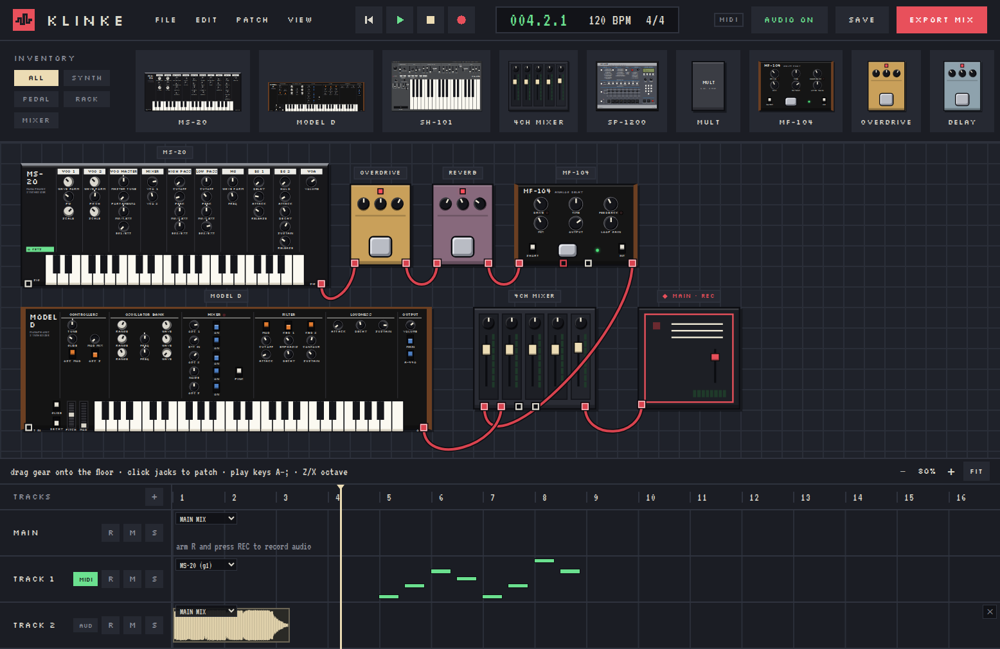

<p align="center"></p>

<p align="center"></p>

<p align="center">
  A pixel-art patchbay studio in the browser · Built with Angular and the Web Audio API
</p>

KLINKE is a modular music studio laid out like a floor of hardware. Drag synths, a sampler,
pedals and rack effects onto the floor, patch them together with cables, play them from the
computer keyboard or a MIDI controller, and record the result onto a 16-bar timeline. Every
sound is generated live in the browser; there is no server.

**Live demo:** https://jonobail.github.io/klinke/

## Features

- **Patch anything into anything.** Each piece of gear has real IN and OUT jacks; signal flows
  only where cables go, and feedback loops are refused.
- **Synths modelled on their service manuals:** MS-20, Model D and SH-101, each with its original
  voice architecture, panel layout and quirks (note priority, glide, arpeggiator, sequencer).
- **SP-1200 sampling drum machine** that samples whatever you patch into it, driven from its
  front-panel keys and LCD like the original.
- **Effects:** overdrive, delay, reverb and filter pedals, the MF-104 analog delay, and twelve
  rack processors (H949, Delta-T, Model 200, PCM-70, PCM-80, DPS-D7 / M7 / R7 / V55 / V77,
  E1010, REV5).
- **MIDI tracks** with live quantised recording and a piano roll.
- **Audio tracks** that record the main mix or any single piece of gear, with waveforms and
  playback scheduled on the audio clock.
- **EXPORT MIX** bounces the song to a WAV file.
- **Works on phones and tablets:** pinch and double-tap zoom, touch-playable keys, iOS audio
  unlock.
- **Saves locally:** patches and songs in localStorage, recorded audio in IndexedDB, and patches
  export / import as JSON.

## Quick start

1. Open the [live demo](https://jonobail.github.io/klinke/). The demo rig is already patched:
   the MS-20 runs through two pedals and the MF-104, and joins the Model D in the mixer
   feeding **MAIN • REC**.
2. Click anywhere to start audio, then play **A S D F G H J K L** (white keys) and
   **W E T Y U O P** (black keys); **Z / X** change octave.
3. Click a synth to give it the keyboard (marked **⌨ KEYS**).
4. Arm a track with **R**, press **REC**, play, then press **EXPORT MIX** to save a WAV.

## Using KLINKE

### Patching

| Action | How |
|---|---|
| Add gear | Drag a tile from **INVENTORY** onto the floor, or click it |
| Connect | Click an OUT jack (red ring), then an IN jack (white ring) |
| Disconnect | Click the cable |
| Move / remove | Drag a box by its body; select it and press **Delete** (or **×**) |
| Adjust controls | Drag knobs and faders vertically, scroll over them, or focus and use the arrow keys |
| Bypass a pedal | Click its footswitch |

Only what reaches **MAIN • REC** is heard. A **MULT** splits one signal to several inputs.

### Playing

The computer keyboard plays one instrument at a time. A MIDI controller works in Chrome and Edge
over HTTPS or localhost, including pitch bend and the mod wheel. You can also click or slide
across any on-screen keyboard.

### Recording

- **Transport:** **Space** plays and stops; **STOP** twice returns to the top; click the ruler to
  move the playhead.
- **MIDI tracks:** switch a track to **MIDI** and pick its instrument. Arm it (**R**) and press
  **REC** to record notes, quantised to the track's grid (default 1/16). Click the lane to open
  the piano roll: click to add a note, drag to move, drag the right edge to resize,
  double-click or **Delete** to remove.
- **Audio tracks:** choose what the track records: **MAIN MIX** or one piece of gear's OUT. Arm
  it and press **REC**; the take appears with its waveform and plays back in time with the song.
  Mute (**M**) and solo (**S**) apply. **✕** deletes a track's takes. Wrapping round the loop or
  moving the playhead while recording starts a new take.
- **EXPORT MIX** (or **FILE → Export mix**) plays the song once from the top in real time,
  through the last note or take plus a bar for tails, and downloads `klinke-mix.wav`. Click
  again to cancel.
- **SAVE** (or **Ctrl+S**) keeps the patch and song in this browser. Recorded audio is saved
  as soon as each take ends.

### Instrument notes

<details>
<summary><b>MS-20</b></summary>

Monophonic, last note wins; legato playing glides without re-triggering. WAVE FORM and SCALE
click between four positions; knobs with a tick at 12 o'clock are ± intensities that do nothing
at centre. EXT SIG IN runs other audio through its filters.
</details>

<details>
<summary><b>Model D</b></summary>

Monophonic with low-note priority. Rocker switches turn mixer sources and features on; the PITCH
wheel springs back, the MOD wheel stays. Turn OSC 3 off (and its RANGE to LO) to use it as an LFO
through OSC MOD / FILTER MOD. The OVERLOAD lamp lights when the mixer drives the filter hard.
</details>

<details>
<summary><b>SH-101</b></summary>

Monophonic with a sub-oscillator. The LFO also clocks the arpeggiator (UP / U&D / DOWN) and the
sequencer: set SEQ to LOAD, play notes (REST for a gap), then PLAY. Holding a key while it plays
transposes the line; HOLD latches. The sequence is saved with the patch.
</details>

<details>
<summary><b>SP-1200</b></summary>

Click it (or a pad) to give it the keyboard: **A–K** play pads 1–8. The bank button cycles A–D;
the Performance button switches the sliders between Tune/Decay and Mix.

To sample: patch a source into SAMPLE IN (use a MULT to keep it in its chain too), press a pad to
choose the location, press **SAMPLE**, key **5** and set the length with slider 1, then key **9**
to sample now or **7** to arm (sampling starts when the input passes the threshold set with
SAMPLE 4). SET-UP 19 truncates and loops; SET-UP 20 deletes. The LCD prompts each step.
</details>

<details>
<summary><b>MF-104 and rack effects</b></summary>

The MF-104 is an analog delay: RANGE doubles every delay time, and FEEDBACK at the top runs away
into self-oscillation. Flip LOOP to EXT and patch LOOP OUT → another effect → LOOP IN to put that
effect inside the repeats; LOOP GAIN sets how much returns.

The rack processors (under **RACK** in the inventory) patch like pedals; the display shows the
program and setting, and BYPASS passes the signal dry. Each is documented in
[docs/devices/](docs/devices/).
</details>

## Run locally

**Requirements:** Node.js 24 or newer.

```sh
git clone https://github.com/jonobail/klinke.git
cd klinke
npm install
npm start               # http://localhost:4200
npm test                # unit tests for src/app/core (node --test)
npm run build           # production build in dist/klinke
```

`npm run start:tailnet` serves on `0.0.0.0:4200` so other devices on a Tailscale network can
connect. Web MIDI needs HTTPS or localhost, so MIDI controllers only work locally or on the
hosted version.

## Deployment

Every push to `master` runs `.github/workflows/pages.yml`, which runs the unit tests, builds with
`--base-href /klinke/` and publishes to GitHub Pages. The app is fully static.

## Project layout

| Path | Contents |
|---|---|
| `src/app/core/` | Framework-free logic: gear catalogue, patch graph, transport, notes, WAV encoding |
| `src/app/audio/` | Web Audio engine: one unit per gear kind, graph sync, notes, meters, takes storage |
| `src/app/patch-store.ts` | Patch state, selection, cable patching, persistence |
| `src/app/transport.ts` | Song clock and tracks |
| `src/app/sequencer.ts` | MIDI track playback and recording |
| `src/app/recorder.ts` | Audio takes, playback and EXPORT MIX |
| `src/app/gear/` | Gear panels and the knob / fader / keyboard controls |
| `src/app/top-bar/`, `inventory/`, `floor/`, `timeline/`, `piano-roll/` | Screen areas |
| `public/worklets/` | AudioWorklet that captures audio for recording |
| `tests/` | `node --test` suites for `core/` |
| `docs/` | [Roadmap](docs/ROADMAP.md) and per-device design notes |

## Roadmap

Progress and plans are tracked in [docs/ROADMAP.md](docs/ROADMAP.md).
